# Peopld — Application Page Guide

_A walkthrough of every screen · 22 pages · Pre-MVP_

Peopld is a structured networking app for live, in-person events. Guests join with an access code, get seated at a table each round with people worth meeting (helped by a fresh icebreaker), rotate, and walk away with a rolodex of everyone they met. Organizers run the whole evening from a console.

This guide walks every screen in the app, grouped by who uses it. Each entry lists the page's route, what it is, what happens there, and anything worth pointing out. A screenshot box follows each page — drop the matching screenshot in before sharing.

## Public & Entry

_Screens anyone can reach before joining an event._

### 1. Landing page

**Route:** `/`

**What it is.** Peopld's public marketing home.

**What happens here**

- Visitors learn what Peopld is — hero, the problem it solves, how it works, a gallery of the experience, and a final call to action.
- Links out to sign in / get started.

**Worth pointing out**

- Pure marketing, light theme; all copy lives in one content file so it's easy to edit.
- This is the front of the funnel — it leads into the sign-in screen.

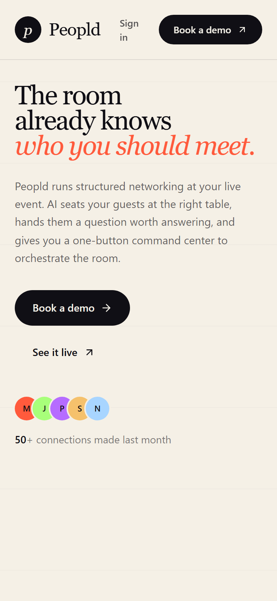

### 2. Sign in / Sign up

**Route:** `/auth`

**What it is.** One passwordless screen for attendees — signing in and signing up are the same flow.

**What happens here**

- Continue with email (we send a 6-digit code) or with Google.
- Already signed in? You skip the form and continue straight to wherever you were headed.

**Worth pointing out**

- No password, no app to install.
- The organizer sign-in is deliberately separate and not linked here.

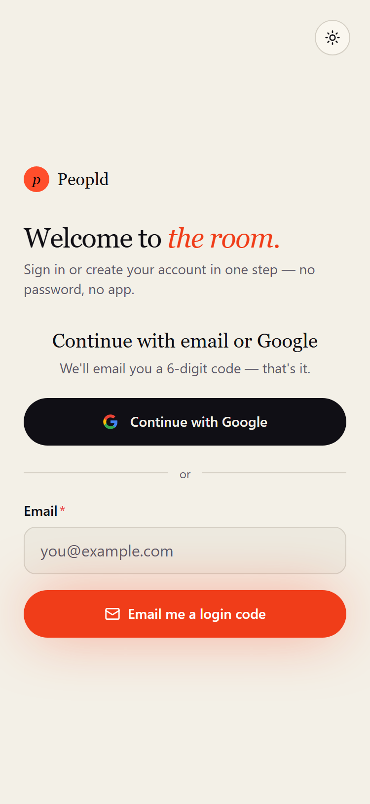

### 3. Join via invite link / QR

**Route:** `/join`

**What it is.** Where the door QR code and shared invite links point.

**What happens here**

- A code carried in the link is filled in and submitted automatically, dropping a signed-in guest straight onto the event's registration page.
- Signs the person in first if needed; typing a code by hand still works too.

**Worth pointing out**

- An extra, friendlier door — not a replacement for the access code.
- A stale or mistyped code falls back to the manual code gate, pre-filled so it's easy to fix.

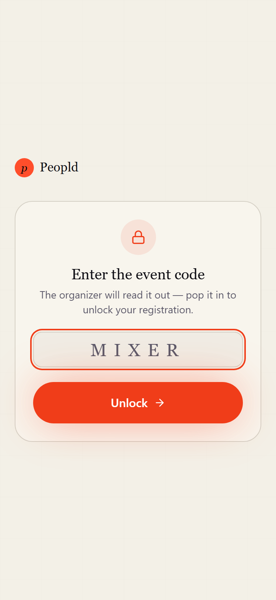

### 4. Event landing (placeholder)

**Route:** `/event/[eventId]`

**What it is.** A stub route that isn't a real screen yet.

**What happens here**

- Currently renders only a bare “Event Landing” line.

**Worth pointing out**

- Not built out — the real per-event entry point is the Register page. Listed here for completeness.

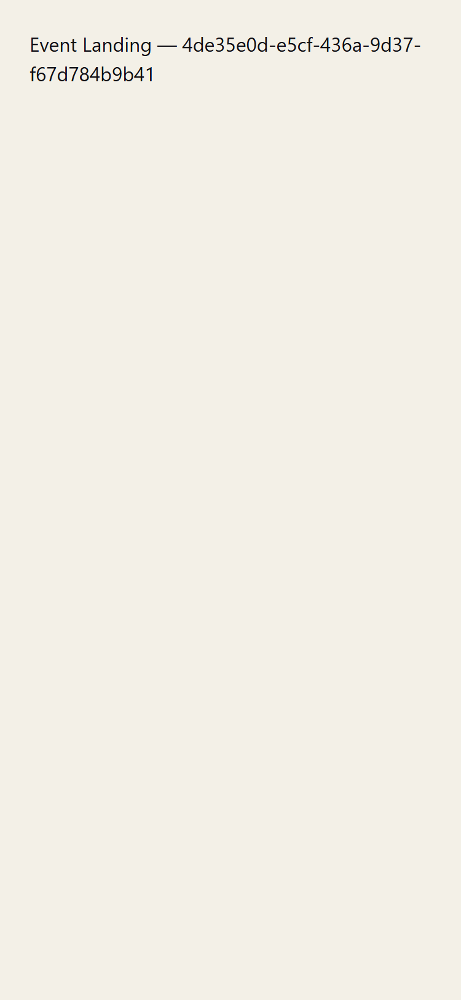

## Attendee App

_Everything a guest sees, in roughly the order they meet it._

### 5. Home / Hub

**Route:** `/home`

**What it is.** The attendee's home base after signing in.

**What happens here**

- A personal greeting, then two primary actions: Join via access code, and My connections.
- Below that, “Your events” grouped into Happening today / Upcoming / Past for easy re-entry.

**Worth pointing out**

- On first sign-in, a one-time profile setup is required before the hub appears.
- An account menu gives quick access to edit profile, connections, and sign out.

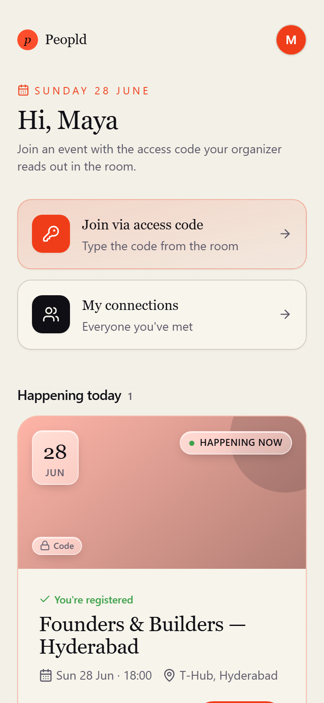

### 6. Your profile (global)

**Route:** `/me/profile`

**What it is.** Your single profile, reused as the starting point for every event you join.

**What happens here**

- Capture name, role, company, what you're working on, who you're looking to meet, interests, LinkedIn, and website.
- Doubles as the mandatory first-login setup screen.

**Worth pointing out**

- Set it once — no retyping the same details at every event.
- Link fields are tidied up automatically (a bare domain becomes a proper link).

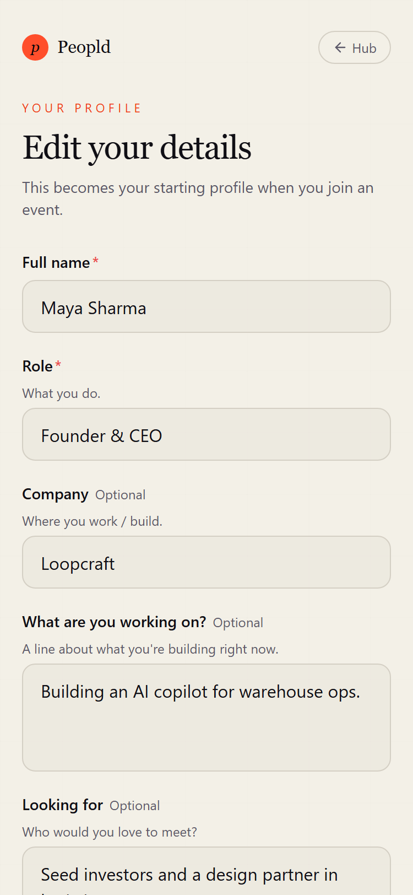

### 7. Register / join an event

**Route:** `/event/[eventId]/register`

**What it is.** The front door for a specific event — access-code gate plus the join form.

**What happens here**

- Shows a public “you're invited” header (event name, date, location, how many are already inside).
- Signs you in if needed, asks for the access code when the event requires one, then shows the join form pre-filled from your global profile.
- Already registered? You're sent straight to the live screen. Event over? It shows registration as closed.

**Worth pointing out**

- Picks up your Google photo so name cards show a face.
- If you're the event's organizer, it nudges you toward the dashboard.

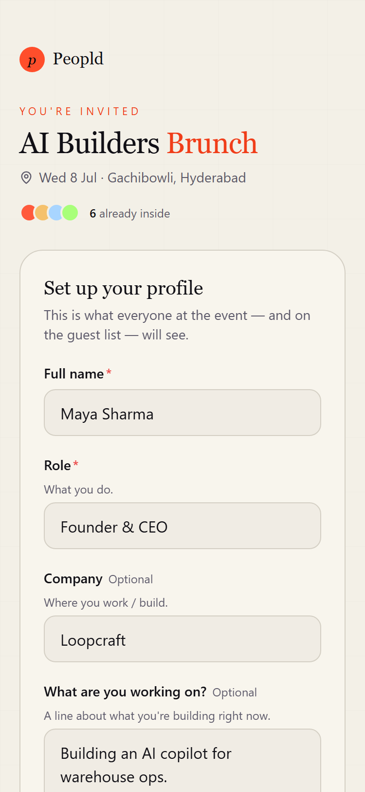

### 8. Live dashboard / waiting room

**Route:** `/event/[eventId]/live`

**What it is.** The one screen a guest lives on during the event — it changes with the event's phase.

**What happens here**

- Waiting room before the event starts; room-code check-in to confirm you're physically there.
- When a round is running: your table, your tablemates, and the round's icebreaker prompt. Between rounds and “not seated this round” states are handled too.
- An ended state once the event wraps.

**Worth pointing out**

- Recovers cleanly on refresh, reconnect, or phone wake — a mid-round reload lands you right back at your table.
- Automatically moves you to the recap when the event ends.

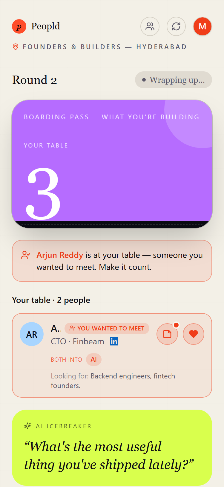

### 9. Who's coming (directory)

**Route:** `/event/[eventId]/directory`

**What it is.** The pre-event guest list, plus your private “who I want to meet” picks.

**What happens here**

- Browse everyone registered — search and filter by Everyone / Speakers / Shared interests — with roles, companies, interests, and links.
- Privately pick the people you most want to meet (up to a cap). Shared interests are highlighted.

**Worth pointing out**

- Picks are private and nudge the seating toward people who picked each other.
- Speakers and hosts can't be picked — they aren't seated in the rotation.

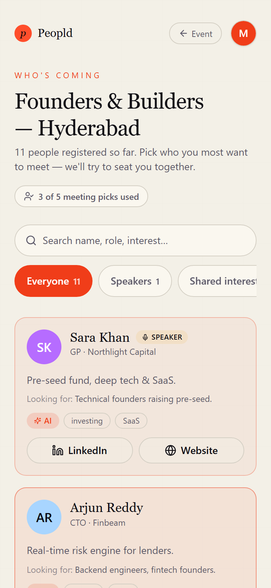

### 10. Your connections (this event)

**Route:** `/event/[eventId]/connections`

**What it is.** Your rolodex for this one event.

**What happens here**

- Everyone you sat with, one card per person, filterable by Everyone / Met / Matches / Liked / Saved.
- Add private notes, see shared-interest chips, save a contact, and open their links.

**Worth pointing out**

- “Matches” are mutual likes; saved contacts persist.

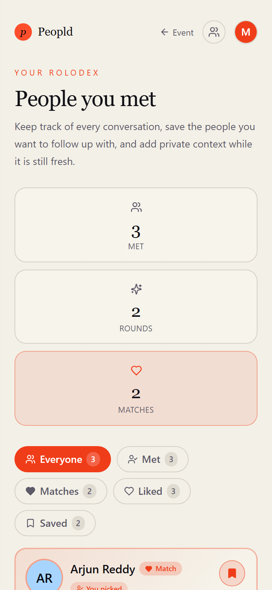

### 11. Edit profile (this event)

**Route:** `/event/[eventId]/profile`

**What it is.** Tweak how you appear at this specific event.

**What happens here**

- Edit your name, role, company, what you're working on, looking-for, interests, and links for this event only.

**Worth pointing out**

- Seeded from your global profile; changes here don't touch other events.

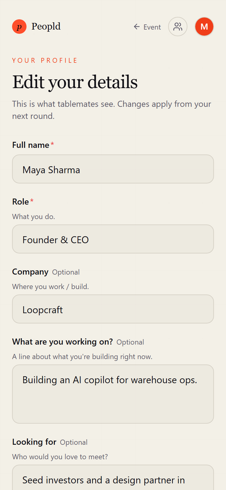

### 12. Recap

**Route:** `/event/[eventId]/recap`

**What it is.** The post-event celebration and handoff to your contacts.

**What happens here**

- Your event in numbers — people met, rounds, hearts sent, matches.
- “You both wanted to meet” mutual picks are revealed, a button leads into your connections, and there's an optional quick star rating.

**Worth pointing out**

- Appears when the event ends; the feedback ask is one-time and never re-nags once submitted.

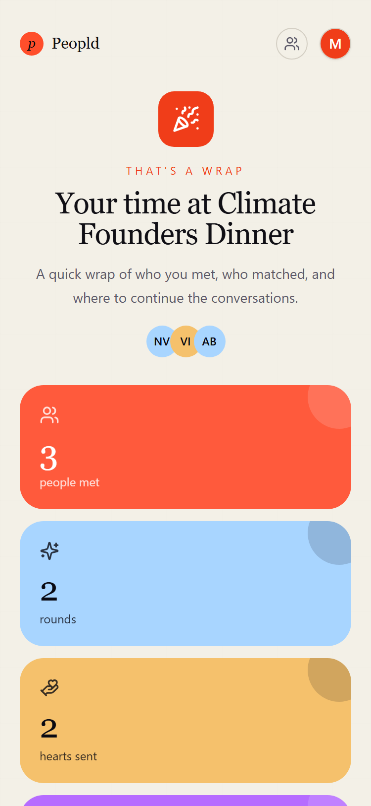

### 13. My connections (all events)

**Route:** `/me/connections`

**What it is.** Your cross-event rolodex — everyone you've met across every event.

**What happens here**

- All your connections, with an event dropdown, search, and Met / Matches / Liked / Saved filters, plus notes and links.

**Worth pointing out**

- The same person met at two events shows up twice, each tagged with its event.

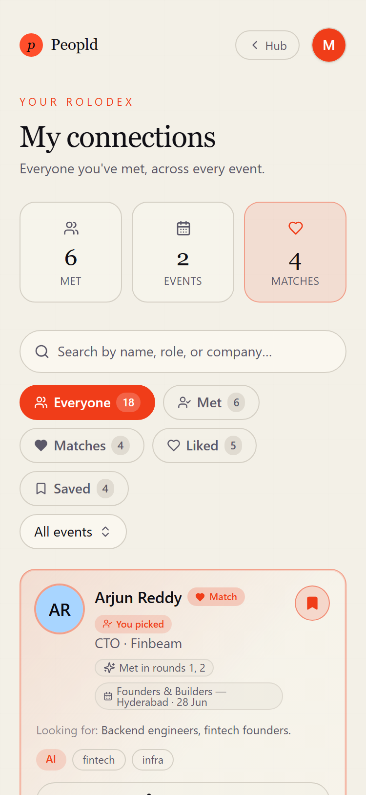

## Organizer Console

_The screens organizers use to set up and run an event._

### 14. Organizer login

**Route:** `/organizer/login`

**What it is.** Private email + password sign-in for organizers.

**What happens here**

- Email and password; already-signed-in organizers skip to the dashboard.

**Worth pointing out**

- Separate from the attendee passwordless flow.
- A signed-in attendee who lands here is sent to their own home — there's no console for them.

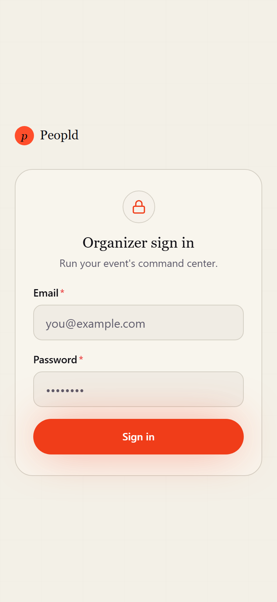

### 15. Dashboard

**Route:** `/organizer/dashboard`

**What it is.** The organizer's command-center home.

**What happens here**

- A greeting, a stats bento across all your events (events, guests, connections, introductions), and your events with the live one highlighted.
- Quick link to create an event.

**Worth pointing out**

- Owner-only; the stats panel is best-effort, so a hiccup there never blanks the whole page.

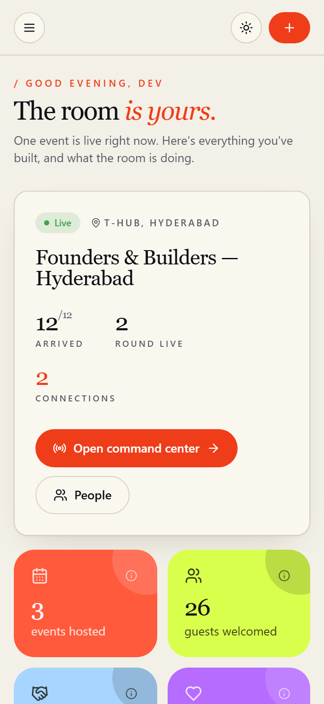

### 16. Events

**Route:** `/organizer/events`

**What it is.** All your events, with create and filters.

**What happens here**

- List of events filterable by All / Active / Upcoming / Ended, a show-archived toggle, and a create-event form.

**Worth pointing out**

- Each card deep-links into that event's console.

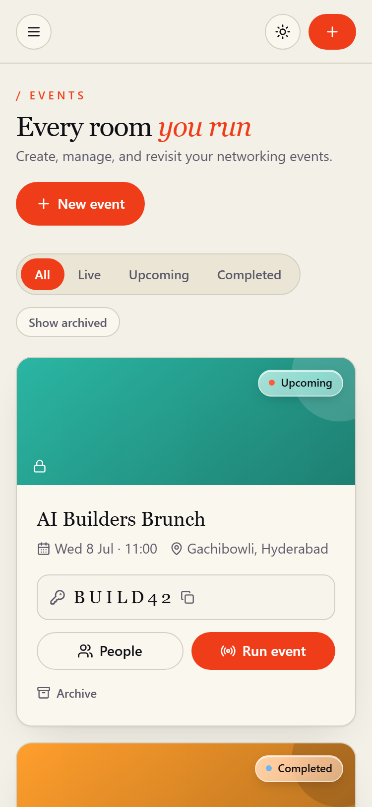

### 17. Live control room

**Route:** `/organizer/event/[eventId]/live`

**What it is.** The cockpit for running the event live.

**What happens here**

- Room-code panel for check-in; the round lifecycle — idle, plan/name a round (draft), run it (active), then ended.
- A bento of live stats and a link to the run sheet.

**Worth pointing out**

- Owner-only; this is the reliability-critical screen during the event.

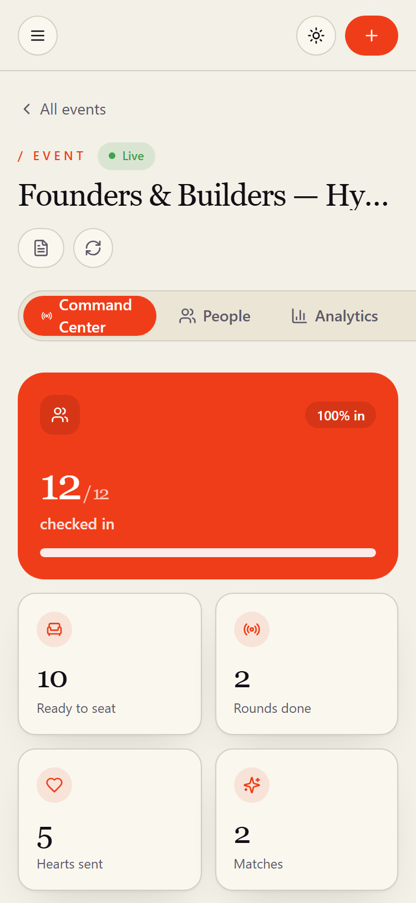

### 18. Analytics

**Route:** `/organizer/event/[eventId]/analytics`

**What it is.** Post-event intelligence, deliberately separate from the live cockpit.

**What happens here**

- Relationship analytics, the network/relationship graph, funnel and coverage views, and event-memory insights.

**Worth pointing out**

- Owner-only; the heavy charts and graph load only here, keeping the live screen light.

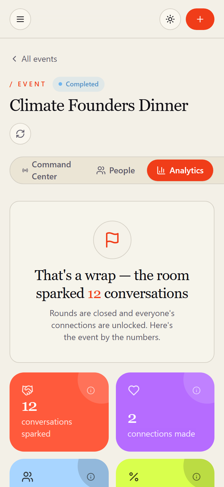

### 19. People

**Route:** `/organizer/event/[eventId]/people`

**What it is.** The guest-list manager.

**What happens here**

- See every attendee with status (registered / arrived / left) and tag (attendee / speaker / host); search and sort.
- Check people in, mark them left, or undo; add a person (guest or speaker) with a full profile; open the invite dialog (QR + access code); export contacts to CSV.

**Worth pointing out**

- “Add person” supports staging guests and speakers before the event, not just day-of walk-ins.
- The CSV export is Excel-friendly.

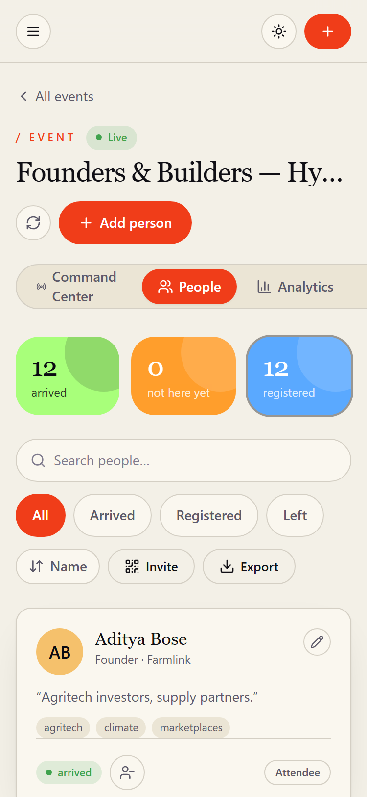

### 20. Run sheet

**Route:** `/organizer/event/[eventId]/run-sheet`

**What it is.** An event-day operations console that also prints cleanly.

**What happens here**

- Searchable seating for every round — find any attendee's table, jump between rounds.
- Prints or saves as a plain white PDF for a paper backup if the app ever falls over.

**Worth pointing out**

- Rounds that have happened are frozen; future rounds are projections that reshape if the roster changes.
- On-screen controls are hidden when printing.

### 21. Event settings

**Route:** `/organizer/event/[eventId]/settings`

**What it is.** Configure a single event.

**What happens here**

- Edit the details (name, date, time, location, description, tables), manage the access code (view / regenerate / remove), set the round agenda and names, and add sponsors.

**Worth pointing out**

- The access code is managed here; up to 20 sponsors.

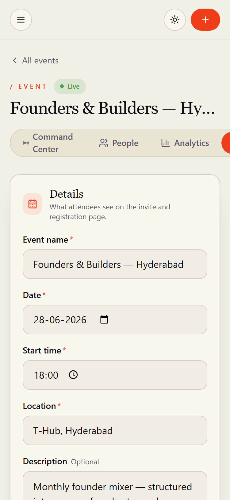

### 22. Organizer settings

**Route:** `/organizer/settings`

**What it is.** Account-level preferences for the organizer.

**What happens here**

- Choose a theme (light / dark / system), see account info, and view the palette.

**Worth pointing out**

- App-wide, not tied to any single event.

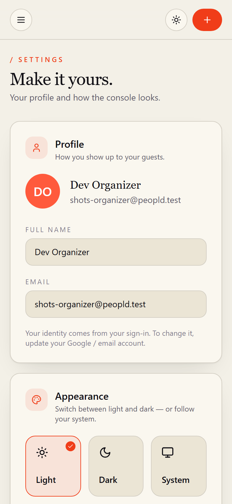
