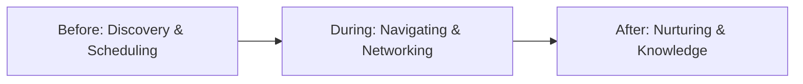

# Attendee Journey

This document maps the complete lifecycle for the Event Participant.

## High-Level Workflow

## Phase 1: Before Event

### Step: Registration & Profile Setup
*   **Goal:** Secure a ticket and set up a profile that attracts the right connections.
*   **Action:** Fills out form, pays for ticket, links LinkedIn, and sets networking goals.
*   **Pain Point:** Filling out the same "About Me" and "Job Title" for every single event manually.
*   **Data Generated:** AttendeeRecord, Initial GlobalUser (if new), Transaction.
*   **Domain Ownership:** `Registration`, `Identity`, `Billing`
*   **AI Opportunity:** Auto-complete profiles by extracting data from LinkedIn; suggest networking goals.
*   **Event Memory Opportunity:** If returning user, 90% of the profile is pre-filled from their Global Identity.
*   **Revenue Opportunity:** Up-sell VIP networking tiers or premium matching during checkout.

### Step: Pre-Event Discovery & Matchmaking
*   **Goal:** Plan the agenda and book high-value meetings before arriving.
*   **Action:** Browses the AI matchmaking feed, sends meeting requests, and bookmarks sessions.
*   **Pain Point:** Scrolling through thousands of attendees blindly hoping to find a relevant match.
*   **Data Generated:** ConnectionRequests, Scheduled Meetings, Bookmarked Sessions.
*   **Domain Ownership:** `AI`, `Networking`, `Meetings`, `Events`
*   **AI Opportunity:** The core Matchmaking algorithm scores all attendees and surfaces the top 10 most relevant people based on shared interests and past Event Memory.
*   **Event Memory Opportunity:** Recommending people they met 2 years ago who are also attending this event.
*   **Revenue Opportunity:** None directly, but high pre-event engagement drastically reduces refund/no-show rates.

## Phase 2: During Event

### Step: On-Site Navigation & Spontaneous Networking
*   **Goal:** Attend sessions, meet scheduled contacts, and discover new people organically.
*   **Action:** Checks into sessions, uses mobile app to find tables, scans badges to capture connections.
*   **Pain Point:** Finding the right person in a crowded room; losing physical business cards.
*   **Data Generated:** ConnectionAccepted, Location Check-ins, Messages.
*   **Domain Ownership:** `Networking`, `Messaging`, `Events`
*   **AI Opportunity:** "Near Me" recommendations (e.g., "A highly-matched prospect is currently at the coffee stand").
*   **Event Memory Opportunity:** Every badge scan or accepted meeting permanently links the two nodes in the global relationship graph.
*   **Revenue Opportunity:** In-app purchases for "Priority Messaging" (LinkedIn InMail style) if an attendee wants to bypass connection limits.

## Phase 3: After Event

### Step: Follow-up & Long-Term Nurture
*   **Goal:** Convert connections into actual business outcomes, friendships, or hires.
*   **Action:** Exports contacts, sends follow-up emails, or connects on LinkedIn.
*   **Pain Point:** The event app shuts down 2 days after the event. The attendee loses context on *why* they connected with someone or what they discussed.
*   **Data Generated:** InteractionLogs, RelationshipGraph updates.
*   **Domain Ownership:** `Networking`, `Integrations`
*   **AI Opportunity:** Copilot drafts personalized follow-up emails based on the chat history and session overlaps from the event.
*   **Event Memory Opportunity:** The platform *does not shut down*. The attendee can return 6 months later, search "investors I met in 2024," and view their full history.
*   **Revenue Opportunity:** Charging attendees a low-tier SaaS fee for a "Personal Event CRM" that aggregates all their connections across all events on the platform.
