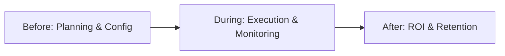

# Organizer Journey

This document maps the complete lifecycle for the Event Host/Organizer.

## High-Level Workflow

## Phase 1: Before Event

### Step: Event Configuration & Ticketing
*   **Goal:** Set up the event metadata, capacity, and generate revenue via ticket sales.
*   **Action:** Creates the event, configures ticket tiers, and publishes the registration page.
*   **Pain Point:** Fragmented tools. Ticketing is often disconnected from the networking/AI platform.
*   **Data Generated:** Event Metadata, Ticket Inventory, Revenue rules.
*   **Domain Ownership:** `Events`, `Ticketing`, `Billing`
*   **AI Opportunity:** Copilot assists in generating event descriptions and suggesting optimal ticket pricing based on historical data.
*   **Event Memory Opportunity:** Seed the new event with previous attendees for targeted marketing.
*   **Revenue Opportunity:** Ticketing fees, premium feature upsells (e.g., advanced AI matchmaking modules).

### Step: Sponsor & Exhibitor Onboarding
*   **Goal:** Secure event funding and populate the virtual/physical expo floor.
*   **Action:** Sells tiers, invites companies to set up booths, and configures ad placements.
*   **Pain Point:** Managing assets (logos, videos) via email is tedious.
*   **Data Generated:** Sponsor Profiles, Booth Configurations, Ad Inventory.
*   **Domain Ownership:** `Organizations`, `Sponsors`, `Exhibitors`
*   **AI Opportunity:** Predictive lead forecasting (telling sponsors "Based on registrations, expect X leads in your target demographic").
*   **Event Memory Opportunity:** Link returning sponsors to their past performance data.
*   **Revenue Opportunity:** SaaS fees for white-label sponsor portals, percentage cut of ad inventory sales.

## Phase 2: During Event

### Step: Real-Time Monitoring & Operations
*   **Goal:** Ensure smooth execution and high engagement.
*   **Action:** Monitors check-ins, session attendance, and platform health via dashboards.
*   **Pain Point:** Analytics are often delayed; hard to pivot if a session is failing or a sponsor isn't getting traffic.
*   **Data Generated:** Check-in timestamps, Live Metrics.
*   **Domain Ownership:** `Analytics`, `Events`
*   **AI Opportunity:** Real-time anomaly detection (e.g., "Sponsor X is receiving 80% less traffic than average, suggest sending a push notification to drive traffic").
*   **Event Memory Opportunity:** Capturing live interactions to enrich the global relationship graph.
*   **Revenue Opportunity:** Upcharging for "Live Command Center" real-time analytics dashboards.

## Phase 3: After Event

### Step: Post-Event Reporting & ROI Proof
*   **Goal:** Prove to stakeholders, sponsors, and exhibitors that the event was a success to secure next year's budget.
*   **Action:** Exports reports, analyzes NPS, and distributes lead lists.
*   **Pain Point:** Data is siloed. Proving exact attribution (e.g., this ad click led to this booked meeting) is nearly impossible.
*   **Data Generated:** Final Reports, Aggregated Metrics.
*   **Domain Ownership:** `Analytics`, `Sponsors`
*   **AI Opportunity:** AI generates narrative summaries of the data ("Your event succeeded because...").
*   **Event Memory Opportunity:** The platform shifts from "Event Mode" to "Community Mode," keeping the organizer engaged with their audience year-round.
*   **Revenue Opportunity:** Transitioning the organizer from a one-time "Event License" to a recurring "Annual Community SaaS Subscription".
