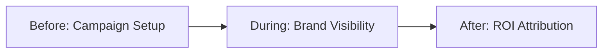

# Sponsor Journey

This document maps the complete lifecycle for the Brand Sponsor.

## High-Level Workflow

## Phase 1: Before Event

### Step: Campaign Configuration
*   **Goal:** Maximize brand awareness and configure targeted messaging.
*   **Action:** Purchases a sponsor tier, uploads logos, configures push notifications, and sets target demographics.
*   **Pain Point:** Sponsors often pay large sums for logos on banners but have zero control over who actually sees their messaging.
*   **Data Generated:** SponsorTier, Campaign, AdAssets.
*   **Domain Ownership:** `Sponsors`, `Billing`
*   **AI Opportunity:** Generative AI assists in creating high-converting copy for push notifications or sponsored sessions.
*   **Event Memory Opportunity:** Leveraging past event data to guarantee a certain number of impressions from a specific demographic.
*   **Revenue Opportunity:** Tiered sponsorship packages; selling ad inventory.

## Phase 2: During Event

### Step: Brand Visibility & Engagement
*   **Goal:** Drive attendees to sponsored sessions, booths, or external landing pages.
*   **Action:** Platform displays ads; sponsor tracks real-time clicks and impressions on their dashboard.
*   **Pain Point:** Lack of real-time adjustment. If an ad isn't performing, it can't be changed on a printed banner.
*   **Data Generated:** Impressions, Clicks, AdDisplayed Events.
*   **Domain Ownership:** `Sponsors`, `Analytics`
*   **AI Opportunity:** Dynamic Ad Bidding/Routing. The AI automatically serves the sponsor's ad to attendees whose profiles match the sponsor's target persona.
*   **Event Memory Opportunity:** Recognizing if an attendee clicked a sponsor's ad last year and re-targeting them.
*   **Revenue Opportunity:** Pay-Per-Click (PPC) or Pay-Per-Lead models, shifting away from flat-fee "Gold/Silver" packages.

## Phase 3: After Event

### Step: ROI Attribution
*   **Goal:** Justify the marketing spend to the executive team.
*   **Action:** Reviews the final attribution report (Total Impressions, Total Clicks, Total Leads Generated).
*   **Pain Point:** Traditional events provide "estimated foot traffic." Sponsors demand digital-grade attribution (like Google Ads).
*   **Data Generated:** AttributionReport.
*   **Domain Ownership:** `Sponsors`, `Analytics`, `AI`
*   **AI Opportunity:** AI Insight Generation: "Your $10k sponsorship resulted in 500 targeted clicks, yielding a $20 Cost-Per-Click, which is 30% better than your industry average."
*   **Event Memory Opportunity:** Long-term tracking to see if the brand awareness generated at Event A led to a closed deal at Event B.
*   **Revenue Opportunity:** High-tier subscription for cross-event sponsor dashboards, allowing enterprise sponsors to track their ROI across all events they sponsor on the platform globally.
